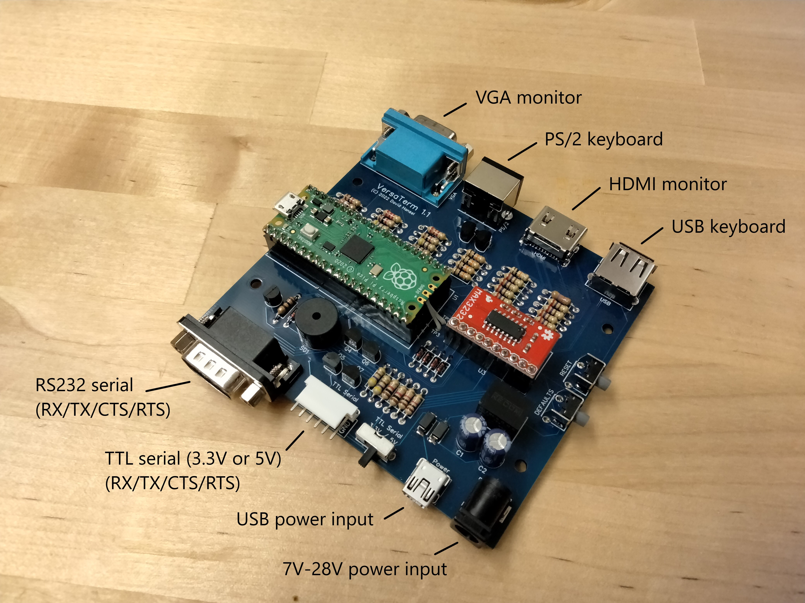

# VersaTerm
A versatile DIY serial terminal.


(more pictures [here](hardware/pictures/ReadMe.md))

### Highlights

- Instant-on/Instant-off - no waiting for OS to boot, no need to shut down safely
- Native HDMI and VGA video output (no conversion)
- Supports PS/2 and USB keyboards (including keyboards with integrated USB hubs)
- RS232 and TTL level serial input/output (TTL switchable between 3.3V and 5V)
- Supports hardware (RTS/CTS) and software (XOn/XOff) flow control
- Can be powered via USB or 7-28V DC
- Highly configurable, including user-uploadable fonts
- Supports all VT100 attributes: bold/underline/blink/inverse
- Supports 16 ANSI colors
- Very good VT100 control sequence support - passes [vttest](https://invisible-island.net/vttest) tests for 80-column VT52/VT100/VT102
- PETSCII mode supports PETSCII character set and control characters, PETSCII (c64) font included
- Easy to DIY - vast majority of soldering is through-hole, firmware can be uploaded via USB (no special equipment required)

### Limitations

The terminal is powered by a Raspberry Pi Pico. The Pico is a microcontroller and does not have integrated graphics
capabilities. It can however still produce video signals (see [PicoDVI](https://github.com/Wren6991/PicoDVI) 
and [PicoVGA](https://github.com/Panda381/PicoVGA)). 
Some limitations for the terminal arise from the Pico's limited processing power:

- Max 80 columns per row (no 132 column support)
- Font characters must be 8 pixels wide (original VT100 was 9 pixels)
- 16 Ansi colors only (no 8-bit or 24-bit color support)

## Uploading the VersaTerm firmware to the Raspberry Pi Pico

Uploading firmware to the Raspberry Pi Pico is easy:
- Press and hold the button on the Raspberry Pi Pico (there is only one) 
- While holding the button, connect the Raspberry Pi Pico via its micro-USB port to your computer
- Release the button
- Your computer should recognize the Pico as a storage device (like a USB stick) and mount it as a drive
- Copy the [VersaTerm.uf2](software/VersaTerm.uf2) file to the drive mounted in the previous step

## Building the VersaTerm firmware from source

### Requirements
- CMake 3.12 or later
- GCC (cross-)compiler: arm-none-eabi-gcc

### Getting and building the source

```
git clone https://github.com/dhansel/VersaTerm.git
cd VersaTerm/software/lib
git submodule update --init
cd pico-sdk/lib
git submodule update --init
cd ../../..
mkdir build
cd build
cmake .. -DPICO_SDK_PATH=../lib/pico-sdk -DPICO_COPY_TO_RAM=1
make
```

This should create file VersaTerm/software/build/src/VersaTerm.uf2<br>
Follow the "Uploading firmware to Raspberry Pi Pico" instructions above to upload the .uf2 file to the Pico.

### TinyUSB updates

The version of TinyUSB currently (May 2022) included with the Pico SDK appears to have problems 
with USB hubs. These issues seem to be resolved in the latest updates though.
To update TinyUSB to the latest version, do the following:
```
cd VersaTerm/lib/pico-sdk/lib/tinyusb
git fetch
git merge origin/master
```
Then just "cd" back to VersaTerm/software/build and type "make" to re-build.
