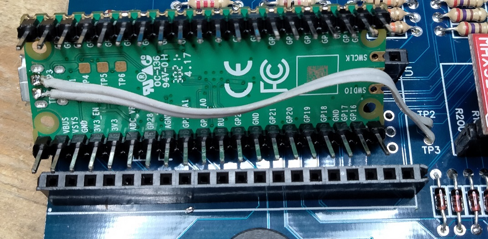
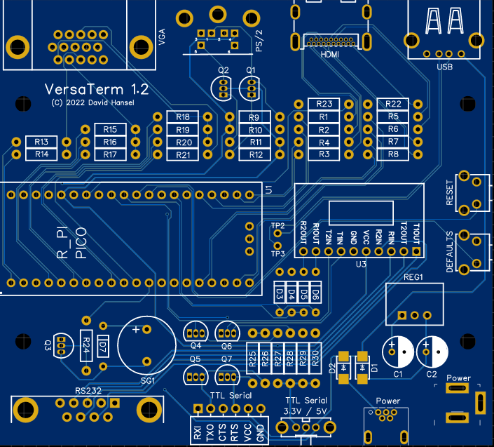

# Component Ordering

I sourced most of the parts from DigiKey. The [VersaTermBOM.csv](VersaTermBOM.csv) file in this folder includes all the parts and their part numbers.
You can also click the link below to automatically create a shopping cart at DigiKey that contains most of the parts: 
https://www.digikey.com/short/d0qw14h1

The the following necessary parts are currently not available at DigiKey and have to be ordered separately:
  - Raspberry Pi Pico: not sold at DigiKey, available at [AdaFruit](https://www.adafruit.com/product/4883), [SparkFun](https://www.sparkfun.com/products/17829), Ebay and others
  - 2N7000 MOSFET (need 7): currently (May 2022) on backorder at DigiKey. Available on EBay from various sellers.

If you want to use the provided [3d-printable enclosure](../enclosure), you will need four machine screws #4-40 with length 22mm (7/8") below the head and matching
#4-40 nuts. DigiKey part #335-1089-ND and #36-9600-ND will fit.
  
# Assembly tips
  
The vast majority of solder points are through-hole and easy to solder, except for the following:
  - Diodes D1 and D2 are surface-mount devices but the diodes themselves are fairly large. I have no SMD soldering experience and had no problem soldering them.
  - The Raspberry Pi Pico does not route the USB data signals to its pin headers. However, there are two test points (TP2 and TP3) on the bottom of the Pi Pico 
  on which the USB data signals can be accessed. Solder in a short wire from TP2 on the Pi Pico board to TP2 on the VersaTerm PCB. Same for TP3.
  

  
  
  

  
  - While the HDMI connector is through-hole, its pins are very closely spaced. I definitely recommend using a multimeter to check there are no solder bridges 
  between the pins after soldering.
  
  Other tips:
  - For the Raspberry Pi Pico, solder female header pins onto the PCB and then male header pins to the Pi Pico. That will make it easier to debug issues later 
  or to replace the Pico if that becomes necessary.
  - I also used male/female headers to connect the Max3232
  - When soldering the male Molex connector for the TTL serial connection to the board, do not stick it into the board as far as it will go, otherwise the 
  female connector will not fit afterwards. I recommend soldering the male connector while plugged into the female one, that way there is definitely enough space.

# Component Placement

  
For supplier and manufacturer part numbers, see [VersaTermBOM.csv](VersaTermBOM.csv)

Designator	|  Component
------------|-------------
R21,R24	| Resistor 100 Ohm
R1,R2,R3,R4,R5,R6,R7,R8	| Resistor 270 Ohm
R14	| Resistor 390 Ohm
R17,R20,R25,R26	| Resistor 470 Ohm
R13,R16,R19,R27,R28	| Resistor 1k
R29,R30	| Resistor 1k or 10k (see note below)
R15,R18	| Resistor 2k2
R22	| Resistor 4.7k
R9,R10,R11,R12,R23	| Resistor 10k Ohm
D1,D2	| Diode SMT Schottky
D3,D4,D5,D6,D7 | Diode Axial 1N4148
Q1,Q2,Q3,Q4,Q5,Q6,Q7 | MOSFET 2N7000
C1,C2 | Capacitor 10uF
3.3V / 5V	| Switch
RESET,DEFAULTS | Button
REG1	| Recom 5V Regulator
SG1	| Buzzer
Power	| Barrel Connector
Power	| USB-B Mini Connector
VGA	| DB15 Connector
PS/2	| PS/2 Connector
HDMI	| HDMI Connector
USB	| USB-A Connector
RS232	| DB9 Connector
TTL Serial	| Molex Connector Male
U1	| Raspberry Pi Pico
U3	| MAX3232 board

**Note:** Some users have [reported](https://github.com/dhansel/VersaTerm/issues/16) issues with VersaTerm receiving data, which was caused by the R29/R30 1k pull-up resistors being too strong. 
If you experience issues receiving then I recommend switching these to 10k.

  
# Finished PCB

