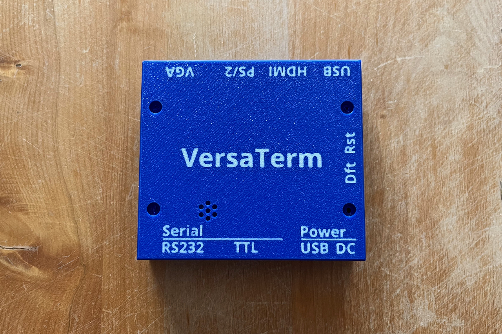

This is a variation on my original enclosure, provided by Greg at [DigicoolThings](https://digicoolthings.com):

  - Bolt holes adjusted to take M3 Bolts (3.2mm), as more readily available to everyone in the metric world. 
  - Nut retainer holes adjusted for M3 Nuts (the imperial nut retainer holes were too big for M3 nuts).
  - Embeded Legends with the product name and the connector names added in 2 colors (for Bambu Lab AMS printing).

The 3d printer files for this version are available on MakerWorld:
https://makerworld.com/en/models/33128#profileId-29923

