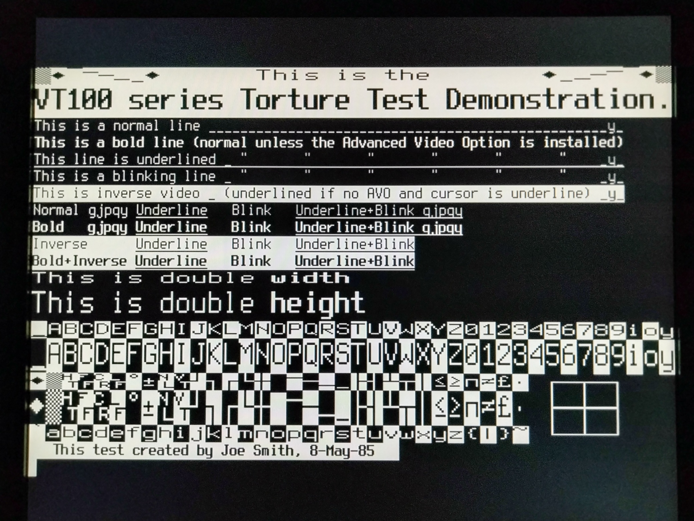
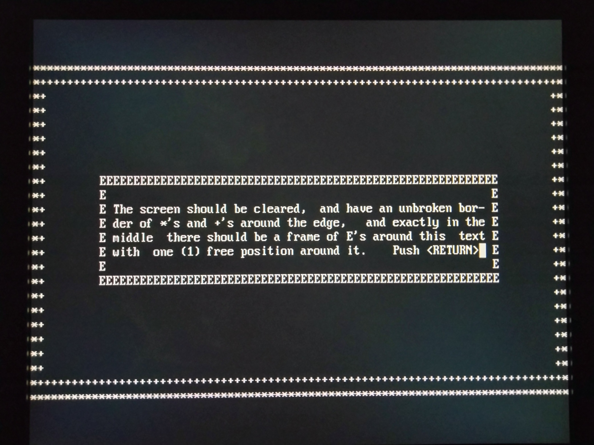
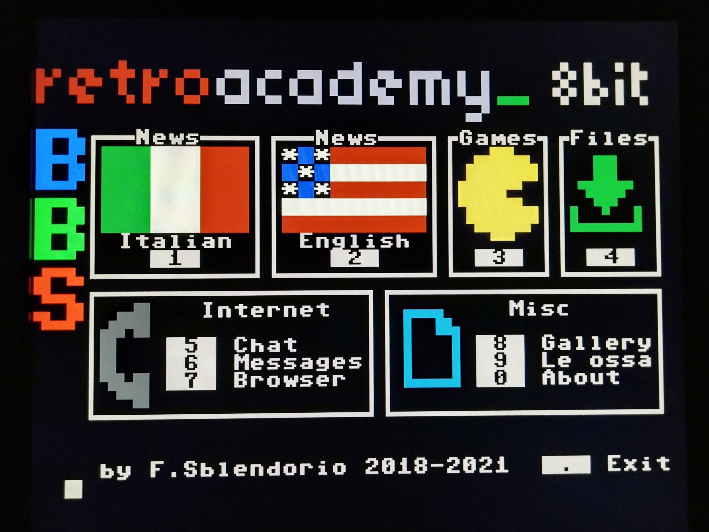

# Settings menu

[Click here for more settings screen shots](settings.md)

# VT100/ASCII graphics

[Click here for more VT100 graphics screen shots](vt100.md)

# VTTest

[VTTest](https://invisible-island.net/vttest) is a test suite for VT100 compatibility.
[Click here for more VTTest screen shots](vttest.md)

# PETSCII graphics

[Click here for more PETSCII graphics screen shots](petscii.md)

