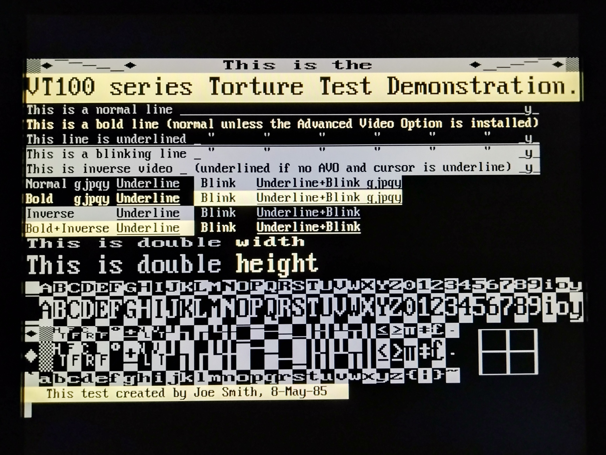
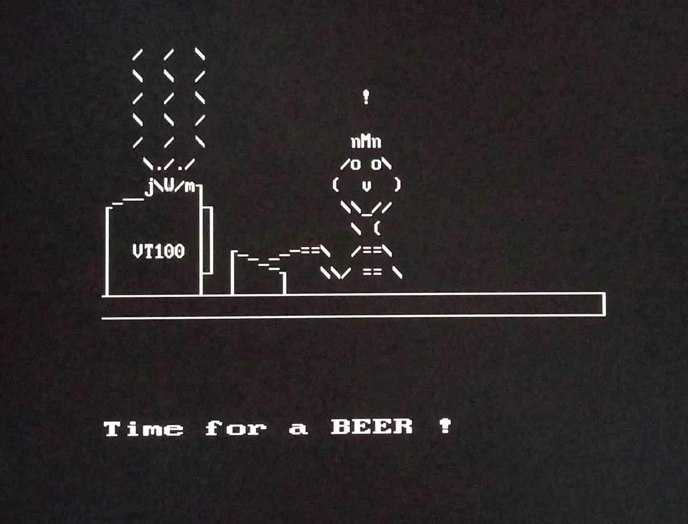

# VT100 / ASCII / ANSI graphics

### VT100 Torture test (using regular and bold font)

Source: http://artscene.textfiles.com/vt100/
Font: Terminus / Terminus bold 
Click [here](https://youtu.be/B1N31KZlwjg) to see a video recording of this test.

  

### VT100 Torture test (no bold font selected - using color instead)

Source: http://artscene.textfiles.com/vt100/
Font: VGA / no bold font, using bright colors for bold characters 
Click [here](https://youtu.be/LtPrxeNTNgQ) to see a video recording of this test.

  

### VT100 "New Beer" animation

Source: http://artscene.textfiles.com/vt100/
Click [here](https://youtu.be/AVb2DMGUi1M) to see a video recording of this test.

  

